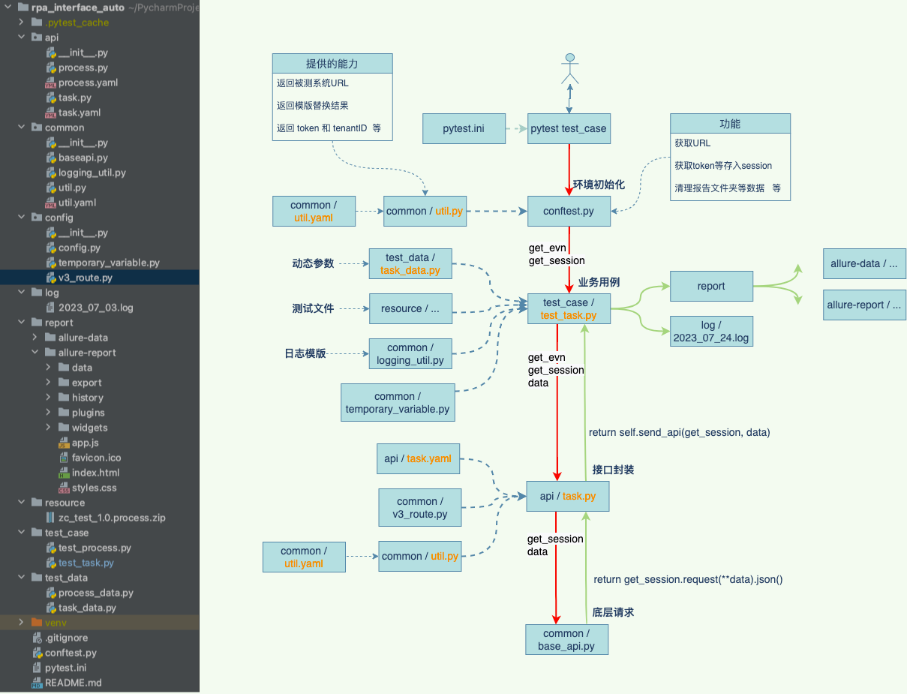

!!! quote
    接口框架选择
        Python + Requests + Pytest + Allure

``` text title="api object原则" linenums="1"
每个公共方法代表接口所提供功能
不要暴露api内部细节
不要在接口实现层写断言
每个method返回其他的api object或则用来做断言的信息
不需要每个api都进行实现
```
 