## 1. 获取基本性能数据
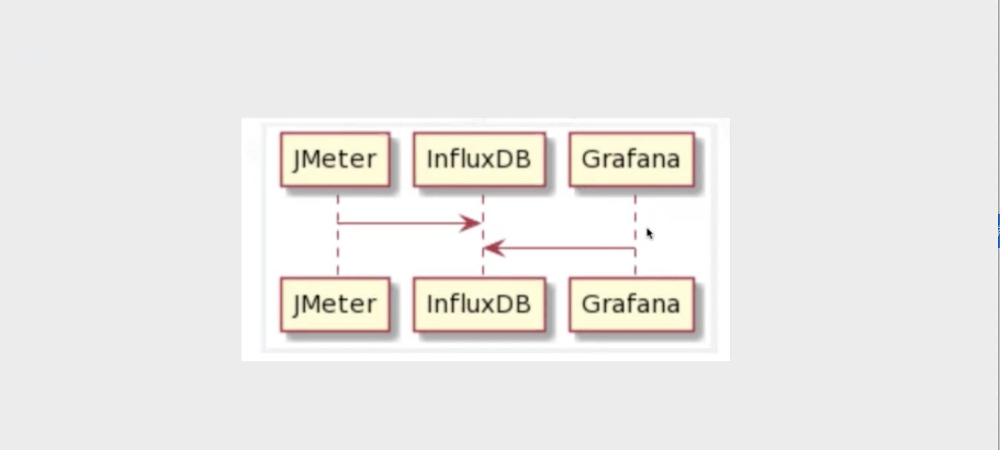

### 1.1 部署InfluxDB
```
	- 官网
		- http://github.com/influxdata/influxdb
	- InfluxDB是一个Go语言开发的开源分布式时序数据库
	- 新建容器网络
		- docker network create grafana
		- 查看容器网络
			- docker network ls
	- 运行容器：
		- docker run -d --name=influxdb --network grafana -p 8086:8086 influxdb:1.7.10
	- 创建数据库
		- docker exec -it influxdb influx
		- 创建表 jmeter
			- create database jmeter;
		- 查看创建的表
			- show database;
	- 其他
		- 查看influxdb的ip地址
			- docker exec -it influxdb sh
			- cat /etc/hosts
	- 配置完成后，如下图
```
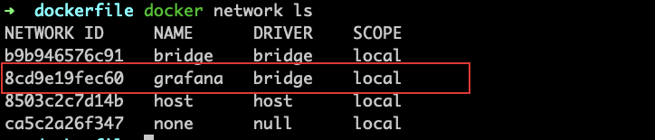
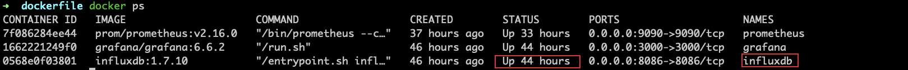


### 1.2 部署Grafana
```
- Github地址
	- http://github.com/grafana/grafana
- Dockerhub地址
	- http://hub.docker.com/r/grafana/grafana
- 运行容器
	- docker run -d --name grafana --network grafana -p 3000:3000 grafana/grafana:6.6.2
	- 访问：http:ip:3000
	- 默认登录账号和密码：admin/admin
- 部署完成后，如下图
```

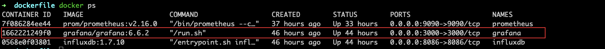


### 1.3 Grafana配置数据源
```
- 配置信息
	- URL: http://influxdb:8086 #influxdb的访问地址
	- Database:jmeter #创建的表
	- Min time interval:5 #提取时间，刷新时间；因为jmeter默认写到influxdb的时间是5s,为了同步，所以grafana读取influxdb需要设置是5s
- 配置
	- 访问Grafana，点击Configuration,点击Data Sources,点击InfluxDB,详细配置附图,配置完成，点击save & Test
```

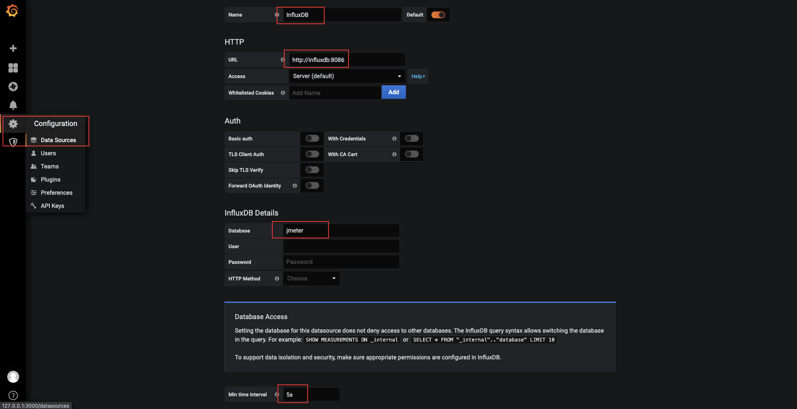

### 1.4 Grafana导入Dashboards
```
- Grafana网站中寻找面板
	- http://grafana.com/grafana/dashboards/5496
- 配置
	- Dashboards - manage - import - input框中搜索上面的面板地址 - 点击load
- 其他
	- Measurement name 代表的就是表名，需要与jmeter配置中后端监听器的Measurement同名
```
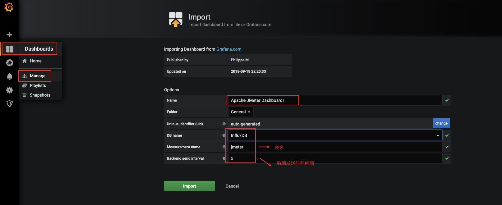

### 1.5 配置Jmeter
```
# 前言
	# influxdb 和 grafana是可以放在服务器里面的，有公网ip，如果没有公网ip就放在一个局域网下面，并且jmeter需要可以访问influxdb，如果是公网，jmeter可以访问jnfluxdb的公网ip，可以写入数据才可以

- 配置附图，以上配置完成
```

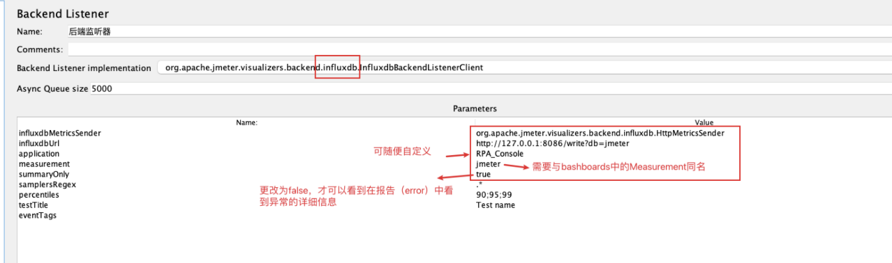
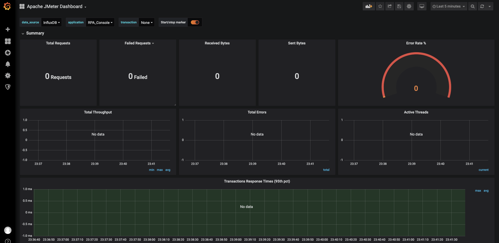


## 2. 获取服务器性能指标
### 2.1 配置Prometheus
```
- 关于Prometheus 
	- Prometheus是一款开源系统监控和警报工具，使用Go语言开发，有各种exporter用来收集服务器性能数据；
- 配置文件
	- https://github.com/prometheus/prometheus/blob/main/documentation/examples/prometheus.yml
- 其他
	- 运行容器前，需要将prometheus.yml文件文放到运行目录下
- 运行容器
	- docker run -d --name prometheus --network grafana -p 9090:9090 -v $PWD/prometheus.yml:/etc/prometheus/prometheus.yml prom/prometheus:v2.16.0 --config.file=/etc/prometheus/prometheus.yml
- 结果如下图
- 访问：prometheus
	- http://localhost:9090/graph
	- 点击Status - Targets
```
### 2.1.1 prometheus.yml
```
# my global config
global:
  scrape_interval: 15s # Set the scrape interval to every 15 seconds. Default is every 1 minute.
  evaluation_interval: 15s # Evaluate rules every 15 seconds. The default is every 1 minute.
  # scrape_timeout is set to the global default (10s).

# Alertmanager configuration
alerting:
  alertmanagers:
    - static_configs:
        - targets:
          # - alertmanager:9093

# Load rules once and periodically evaluate them according to the global 'evaluation_interval'.
rule_files:
  # - "first_rules.yml"
  # - "second_rules.yml"

# A scrape configuration containing exactly one endpoint to scrape:
# Here it's Prometheus itself.
scrape_configs:
  # The job name is added as a label `job=<job_name>` to any timeseries scraped from this config.
  - job_name: "prometheus"

    # metrics_path defaults to '/metrics'
    # scheme defaults to 'http'.

    static_configs:
      - targets: ["localhost:9090"]
```

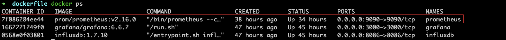
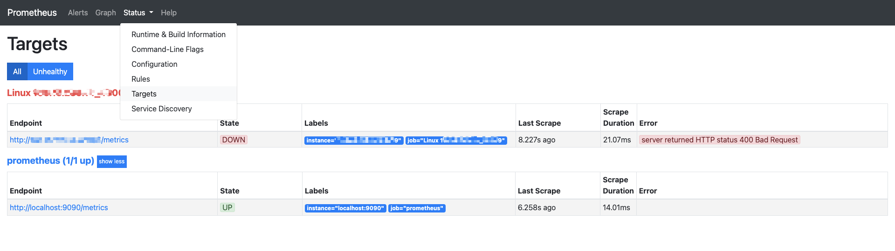

### 2.2 主机监控配置（node_exporter）
```
- 需要在被监控的服务器上下载node_exporter
- 运行容器
	- 方式1
		- docker run -d --name node-exporter -p 40009:9100 prom/node-exporter
		- 其他
			- node-exporter的默认端口是9100，目前是将9100进行了映射，映射为40009端口上；也就是本机开放对外的端口要写前面，后面是容器里面的端口。
	- 方式2
		- 访问：http://github.com/prometheus/node_exporter/releases
		- 查找合适版本：如果是mac，下载node_exporter-1.3.1.darwin-amd64.tar.gz 包；如果是linux_64位，下载node_exporter-1.3.1.linux-amd64.tar.gz 包
		- 在目录下解压后，进入存在node_exporter的二进制文件的目录下
		- 运行
			- nohub ./node_exporter &
			- nohub ./node_exporter --web.listen-address=":9100" &
- 被测服务访问node_exporter
		- http://ip:9100
		- 可见服务参加；如下图1
- 其他
	- 如果9100端口被占用，可以进行更改
		- ./node_exporter --web.listen-address=":9100"
	- 查看帮助文档
		- ./node_exporter --help
```

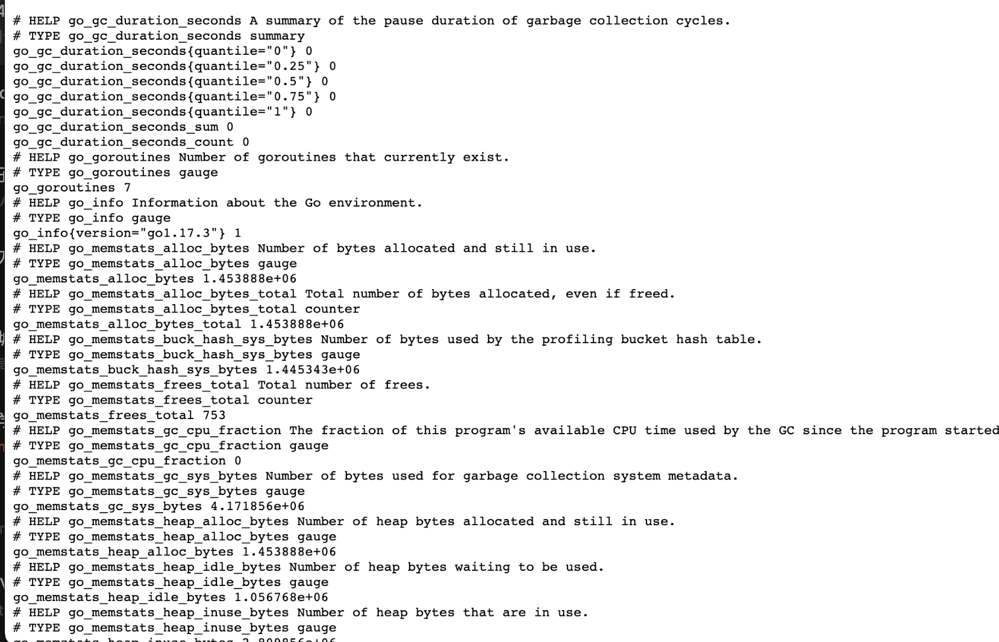

### 2.3 修改prometheus.yml配置
```
# my global config
global:
  scrape_interval: 15s # Set the scrape interval to every 15 seconds. Default is every 1 minute.
  evaluation_interval: 15s # Evaluate rules every 15 seconds. The default is every 1 minute.
  # scrape_timeout is set to the global default (10s).

# Alertmanager configuration
alerting:
  alertmanagers:
    - static_configs:
        - targets:
          # - alertmanager:9093

# Load rules once and periodically evaluate them according to the global 'evaluation_interval'.
rule_files:
  # - "first_rules.yml"
  # - "second_rules.yml"

# A scrape configuration containing exactly one endpoint to scrape:
# Here it's Prometheus itself.
scrape_configs:
  # The job name is added as a label `job=<job_name>` to any timeseries scraped from this config.
  - job_name: "prometheus"

    # metrics_path defaults to '/metrics'
    # scheme defaults to 'http'.

    static_configs:
      - targets: ["localhost:9090"]

  - job_name: "Linux ip" # 名字可自定义

    # metrics_path defaults to '/metrics'
    # scheme defaults to 'http'.

    static_configs:
      - targets: ["被测服务器ip:40009"] #40009为被测服务映射出来的端口
```
### 2.4 在Grafana中配置prometheus，收集服务器的数据
```
- 重启prometheus
	- docker restart prometheus
- 访问prometheus，可见下图1
- 访问Grafana：http:ip:3000
- 配置
	- 下图2
```

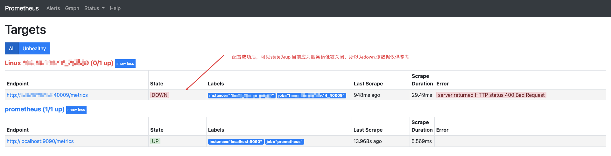
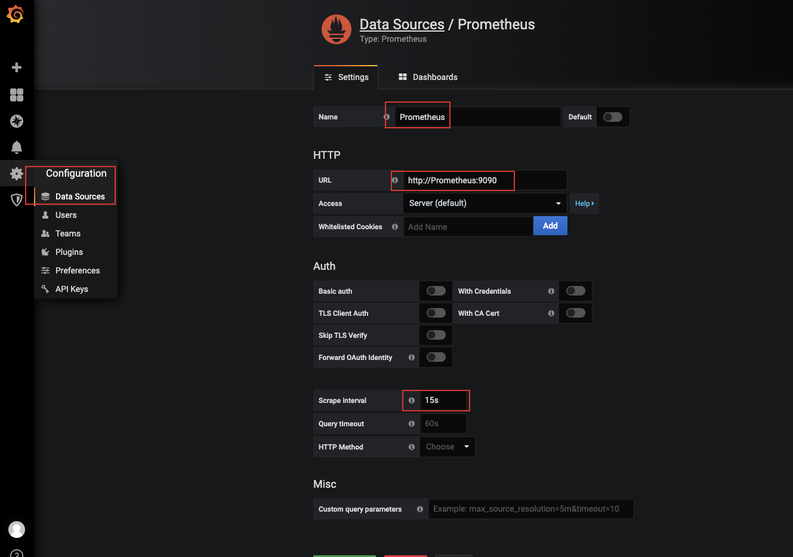


### 2.5 在Grafana中配置dashboards
```
- Grafana网站中寻找面板
	- http://grafana.com/grafana/dashboards/8919
- 配置
	- Dashboards - manage - import - input框中搜索上面的面板地址 - 点击load
	- 如下图
```

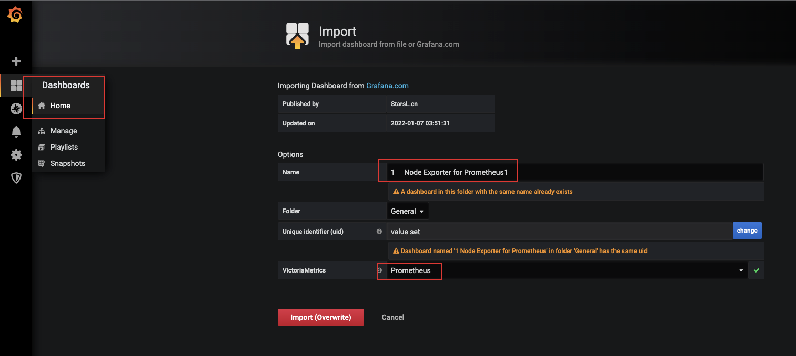
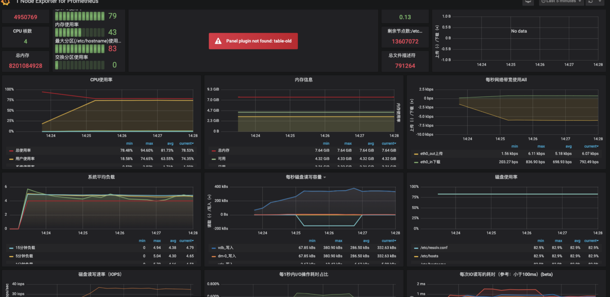
