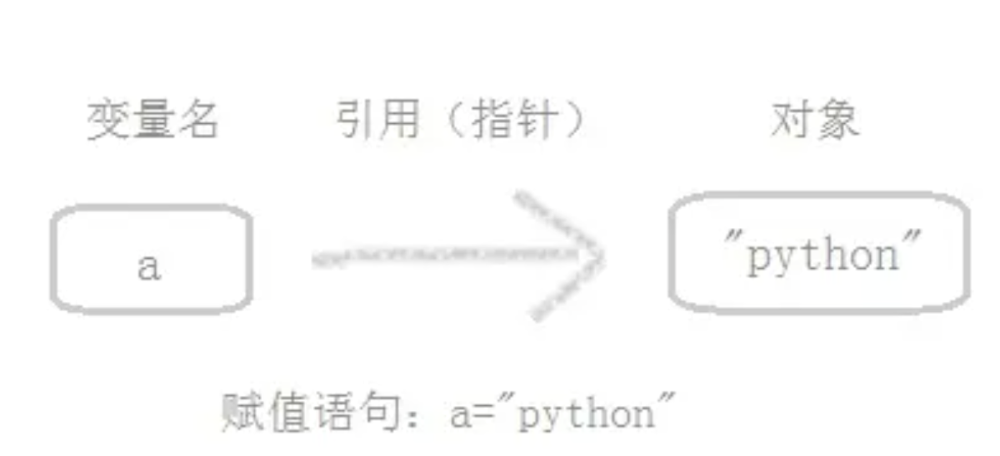
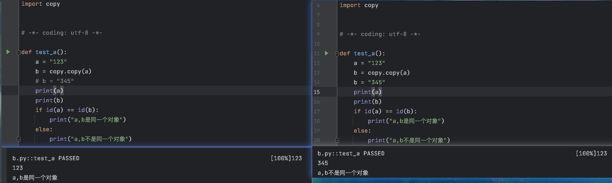
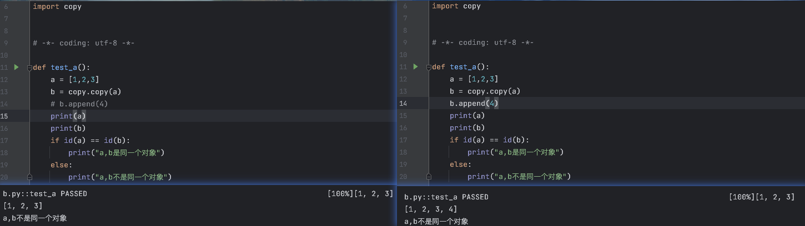
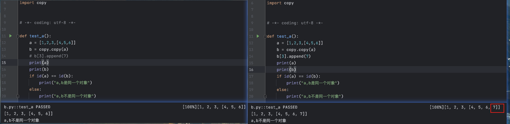

## 概念

=== "变量 & 对象 & 引用"
    ```text linenums="1"
    变量（是一个系统表的元素，拥有指向对象的连接空间）
    对象（被分配的一块内存空间，用于存放具体的值）
    引用（自动形成的变量到对象的指针）
    ```
    

=== "类型 & 可变对象 & 不可变对象"
    ```text linenums="1"
    类型（类型（Type）属于对象本身，而不是对象的变量）（变量本身并不直接具有类型，变量只是引用了一个对象，并且该对象具有自己的类型）
    不可变对象（一旦创建就不可修改的对象，包括字符串、元组、数值类型）（该对象所指向的内存中的值不能被改变。当改变某个变量时候，由于其所指的值不能被改变，相当于把原来的值复制一份后再改变，这会开辟一个新的地址，变量再指向这个新的地址。）
    可变对象（可以修改的对象，包括列表、字典、集合）（该对象所指向的内存中的值可以被改变。变量（准确的说是引用）改变后，实际上是其所指的值直接发生改变，并没有发生复制行为，也没有开辟新的地址，通俗点说就是原地改变）
    ```


## 深拷贝 & 浅拷贝 & 引用
=== "深拷贝"
    ```text linenums="1"
    拷贝了对象的所有元素，包括多层嵌套的元素。深拷贝出来的对象是一个全新的对象，不再与原来的对象有任何关联
    copy模块中的deepcopy函数
    ```

=== "浅拷贝"
    ```text linenums="1"
    定义：创建新对象，其内容是原对象的引用
    实现浅拷贝：切片操作，工厂函数，copy模块中的copy函数
        - 如： lst = [1,2,[3,4]]
        - 切片操作：lst1 = lst[:] 或者 lst1 = [each for each in lst]
        - 工厂函数：lst1 = list(lst)
        - copy函数：lst1 = copy.copy(lst)
    浅复制要分两种情况
        - 当浅复制的值是不可变对象（字符串、元组、数值类型）时
            - 复制后的对象 b 与原始对象 a 具有相同的内存地址，所以只是复制了对象的引用，而不是创建新的对象, 这是由于不可变对象的值在创建后是不可更改的，因此复制操作没有必要创建一个新对象。
        - 当浅复制的值是可变对象（列表、字典、集合）时，存在两种情况
            - 原理：浅复制会创建一个新对象，并将原始对象中的值复制到新对象中。这样，原始对象和浅复制的对象是独立的，它们有不同的内存地址
            - 复制的对象中无复杂子对象, eg:[1,2,3],原始对象的改变不会影响到浅复制的值，因为它们的对象是独立的。
            - 复制的对象中有复杂子对象, eg:[1,2,3,[4,5]], 如果不改变其中复杂子对象，浅复制的值改变并不会影响原来的值。 但是改变原来的值中的复杂子对象的值会影响浅复制的值。
    ```
    
    
    
=== "引用"
    ```text linenums="1"
    引用（自动形成的变量到对象的指针）(这意味着a和b引用相同的内存地址，它们指向同一个列表对象。因此，对于这个共享的列表对象，对其中一个变量的修改会影响到另一个变量)
    ```
    ```py linenums="1"
    a = [1,2,3,4]
    b = a
    b[0] = 4
    print(a[0]) # a[0] = 4
    ```

## 总结
    如果是不可变数据类型，浅拷贝后，值相同，id相同（对象的内存地址相同），如果变更浅拷贝后的值，值不同，id不同
    如果是可变数据类型，无复杂子对象，浅拷贝后，值相同，id不同；如果变更浅拷贝后的值，值不同，id不同
    如果是可变数据类型，有复杂子对象，浅拷贝后，值相同，id不同; 如果变更浅拷贝后的值，值相同，id不同
