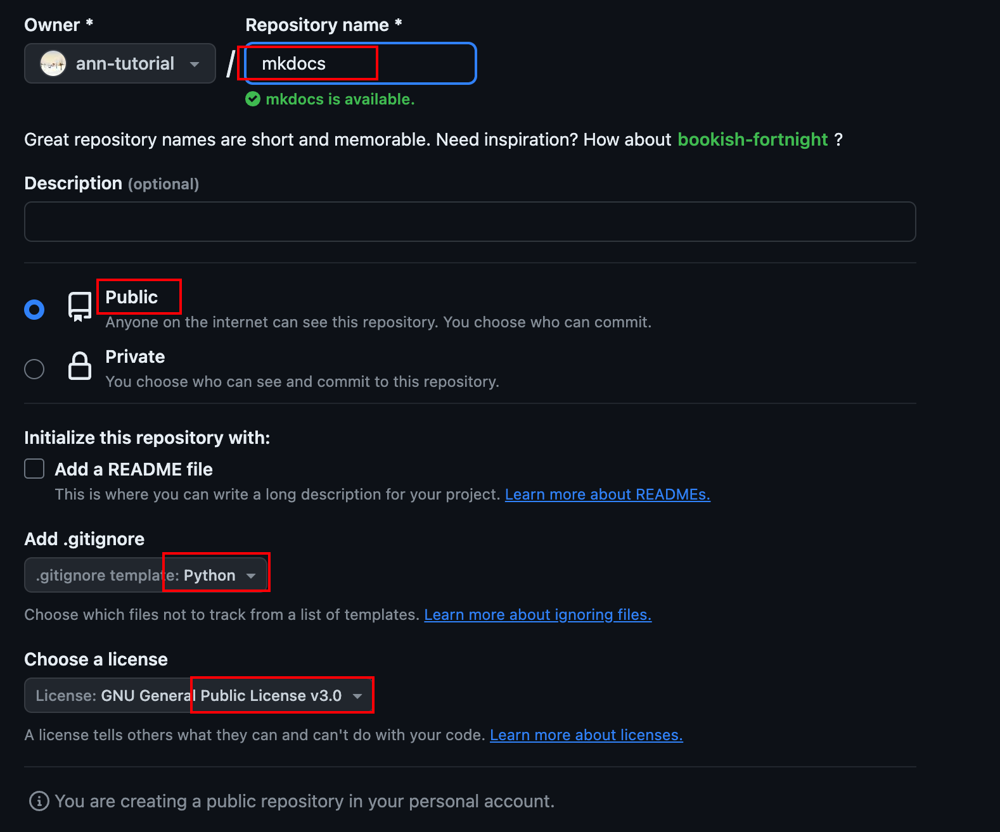

## 环境准备
```text
环境准备: python(必须) Git（可选） VSCODE（可选，或其他ide工具）
```

## Github创建工程（可选）

1. 在Github上创建工程
2. 将工程Clone到本地


## 环境初始化
=== "进入Clone的工程目录"
    ```bash
    cd my-project
    ```

=== "创建python虚拟环境"
    ```bash
    python -m venv .venv # 创建python虚拟环境
    source .venv/bin/activate # 激活虚拟环境
    ```

=== "安装mkdocs"
    ```bash
    pip install mkdocs # 安装mkdocs
    ```
=== "启动mkdocs服务"
    ```bash
    mkdocs new . # 创建一个新的mkdocs工程
    mkdocs serve # 启动一个本地服务器, 并实时更新
    Browser connected: http://127.0.0.1:8000
    ```

=== "安装mkdocs插件等"
    ```bash
    pip install mkdocs-material # 安装mkdocs-material, 一个mkdocs主题
    pip install mkdocs-awesome-pages-plugin # 安装mkdocs-awesome-pages-plugin, 一个mkdocs插件, 用于生成左侧导航栏
    pip show mkdocs-material # 查看material当前安装的版本号
    pip install --upgrade mkdocs-material # 升级material到最新版本
    ```

## 将工程推送到Github (可选)
=== "初始化git"
    ```bash
    git add . # 添加所有文件
    git commit -m "first commit" # 提交到本地仓库
    git push -u origin master # 推送到远程仓库
    ```