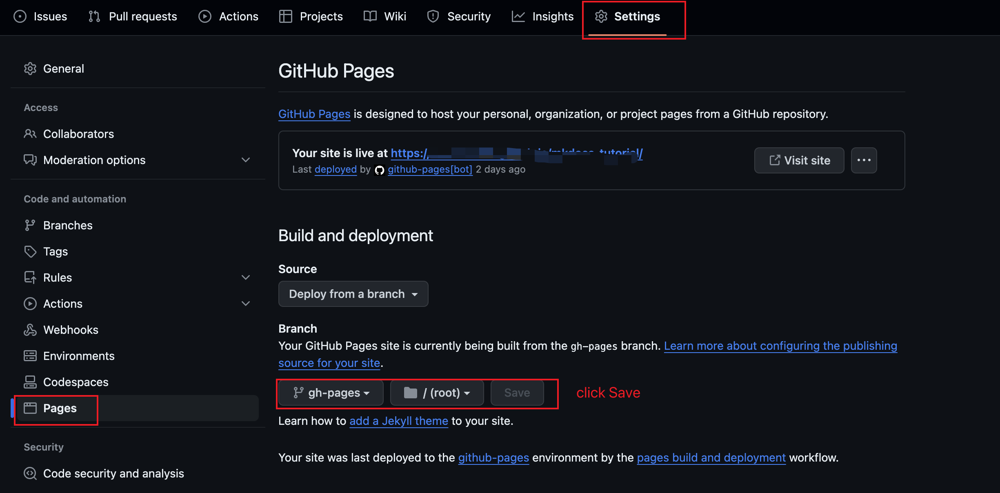
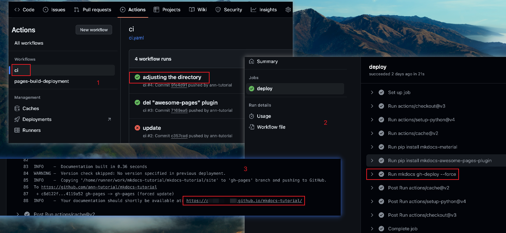

## Github部署
1. 在项目中创建.github/workflows/ci.yaml文件
2. 在ci.yaml文件中添加以下内容
    ```yaml
    name: ci
    on:
      push:
        branches:
          - master
          - main
    permissions:
      contents: write
    jobs:
      deploy:
        runs-on: ubuntu-latest
        steps:
          - uses: actions/checkout@v3
          - uses: actions/setup-python@v4
            with:
              python-version: 3.x
          - uses: actions/cache@v2
            with:
              key: ${{ github.ref }}
              path: .cache
          - run: pip install mkdocs-material
          - run: pip install mkdocs-awesome-pages-plugin
          - run: mkdocs gh-deploy --force
    ```
3. 提交代码到github
4. 在github的Settings中进行如下配置
    - 在Pages中选择gh-pages分支
    - 在Pages中选择docs文件夹（/root）
   
5. 在github的Actions中查看部署状态
   
