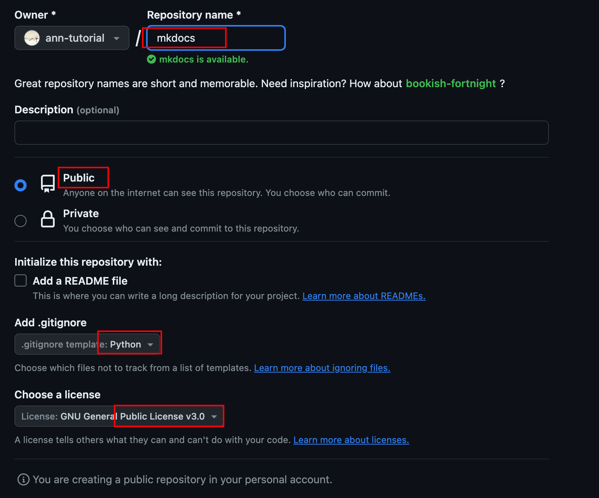

## MkDocs

## install

    1. 环境准备: python Git VSCODE（其他ide工具）
    2. 在Github上创建工程
    3. 在本地

[//]: # (![Screenshot]&#40;img/screenshot.png&#41;)

<!--  -->
<!--  -->

[//]: # (![Image title]&#40;https://dummyimage.com/600x400/eee/aaa&#41;{ align=center })

[//]: # (![Image title]&#40;https://dummyimage.com/600x400/eee/aaa&#41;{ align=right })

[//]: # (![Image title]&#40;https://dummyimage.com/600x400/eee/aaa&#41;{ width="300" })

[//]: # (![Image title]&#40;https://dummyimage.com/600x400/eee/aaa&#41;{ loading=lazy })
<!-- { align=right } -->

For full documentation visit [mkdocs.org](https://www.mkdocs.org).

## Commands

[//]: # (* `mkdocs new [dir-name]` - Create a new project.)

[//]: # (* `mkdocs serve` - Start the live-reloading docs server.)

[//]: # (* `mkdocs build` - Build the documentation site.)

[//]: # (* `mkdocs -h` - Print help message and exit.)

## Project layout

    mkdocs.yml    # The configuration file.
    docs/
        index.md  # The documentation homepage.
        ...       # Other markdown pages, images and other files.

## Project layout

    mkdocs.yml    # The configuration file.
    docs/
        index.md  # The documentation homepage.
        ...       # Other markdown pages, images and other files.

## Project layout

    mkdocs.yml    # The configuration file.
    docs/
        index.md  # The documentation homepage.
        ...       # Other markdown pages, images and other files.

## Project layout

    mkdocs.yml    # The configuration file.
    docs/
        index.md  # The documentation homepage.
        ...       # Other markdown pages, images and other files.

## Project layout

    mkdocs.yml    # The configuration file.
    docs/
        index.md  # The documentation homepage.
        ...       # Other markdown pages, images and other files.

# 132

    mkdocs.yml    # The configuration file.
    docs/
        index.md  # The documentation homepage.
        ...       # Other markdown pages, images and other files.