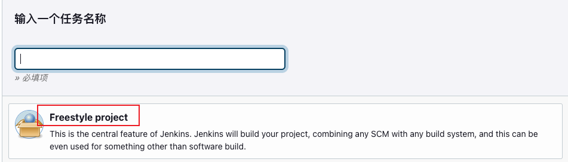

### SonarQube简介

    SonarQube是一个开源的代码质量管理平台，用于管理源代码的质量。它可以检测代码的错误、漏洞和代码异味，以及代码重复率。
    SonarQube支持多种编程语言，包括Java、C#、C、C++、PL/SQL、Python、JavaScript、TypeScript、Ruby、Go、PHP、HTML、CSS、XML等。

### SonarQube

1. 在SonarQube上创建项目, 添加 Project display name, Project key 点击Set Up按钮创建项目
    

### Jenkins
1. 在Jenkins上创建 freestyle 任务
    
2. 配置任务
    
    
    
    
    
    
    
3. 构建后操作

### 查看Sonor报告
1. 在SonarQube上查看报告(原则上需要无bug, 无漏洞, 无代码异味, 无重复率)
    